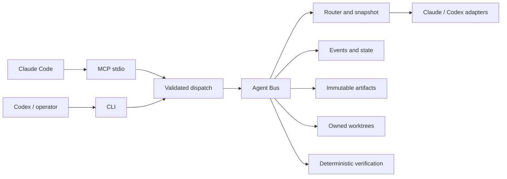
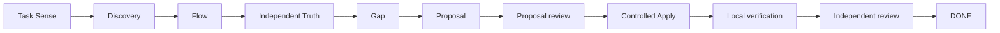

# CQStack — Multi-Agent Engineering Harness

> A runtime for governance, controlled execution and deterministic verification of engineering workflows driven by multiple AI agents.

CQStack is not a prompt framework. It is a core that controls **responsibility, scope, state, evidence, review and permission** for every agent it runs. Models do the work; the harness decides what they are allowed to do and checks what they claim.

> **Known limitation.** CQStack was built as a general runtime, but it still assumes the workspace layout it was developed in: it expects to live at `<workspace>/.cartera/harness` and inspects `cartera-backend`, `cartera-frontend` and `<workspace>/.mcp.json`. Standalone use is on the roadmap (see [Maturity](#what-has-been-built-so-far) and [Roadmap](#roadmap)).

## Motivation

Agentic engineering fails in predictable ways:

- **Overloaded context, blurred ownership.** Agents get too much context, ambiguous scope and overlapping responsibilities.
- **No reproducible evidence.** Text output cannot be reproduced or checked.
- **Self-declared completion.** An agent says "done" and nobody independent reviews it.
- **No canonical state.** Chained prompts leave no audit trail; the conversation *is* the state.
- **Unowned changes.** Edits land in dirty repositories with no clear owner.
- **Capability confused with authority.** What a model can do is treated as what it may do.
- **Diverging surfaces.** Claude (via MCP) and Codex (via CLI) end up with different rules.

The central thesis: **a model may be capable of an action without being authorized to take it.** CQStack separates the two.

## What the harness provides

- An immutable **TaskCapsule** per responsibility: one role, one responsibility, explicit allowed and forbidden paths, permission ceiling, owned tests.
- **Roles with permission ceilings**; a capsule can never broaden its role.
- A central **Agent Bus**; only the orchestrator delegates, and workers never orchestrate workers.
- **State derived from append-only events**, with no second mutable projection.
- **Immutable, versioned, hash-bound artifacts** for every stage.
- **Routing by role → model class → provider profile**, frozen per root in a snapshot.
- **CLI and MCP over the same validated core.**
- **Validation** of schema, scope, evidence (file and line must exist) and changed files.
- **Git worktrees with ownership and quarantine.**
- **Independent reviews bound to the subject's hash.**
- **Controlled test execution by the harness**, kept apart from the worker's own claims.
- **Fail-closed recovery** for truncated logs, stale locks and incompatible state.

## Stack

| Layer | Technology |
| --- | --- |
| Runtime | TypeScript / Node.js ≥ 20 |
| Contracts | JSON Schema Draft-07 + Ajv |
| Agent integration | MCP SDK + adapters for Claude Code and Codex CLI |
| State | Append-only JSONL, filesystem, content hashes |
| Change isolation | Git worktrees |
| Test verification | Docker, Node permission model, deterministic checks |
| Operator interface | CLI and MCP stdio |

Dependencies live only in this package and are pinned by `package-lock.json`.

## Architecture



- **Surface.** One dispatch for CLI and MCP, so both have identical semantics.
- **Bus.** The only component that delegates to a model. It builds the prompt from the capsule and the role's governance, runs the provider, and validates everything that comes back.
- **Router.** Resolves each role to a model class, then to a model per profile. The resolution is persisted once per root.
- **Capsules.** Immutable units of responsibility. A new scope means a new task, never an edited capsule.
- **Schemas.** Canonical protocols for capsules, results, proposals, contracts and reviews. Each provider receives a projected wire schema with deterministic pins, and results are then validated against the canonical schema.
- **Events.** Append-only logs from which task state is reconstructed.
- **Worktrees.** Writes happen only in detached worktrees owned by one task and role. Failed writes are quarantined.
- **Verification.** The harness runs the owned tests itself, in an isolated executor.
- **Providers.** Thin adapters over the Claude Code and Codex CLIs, with minimal tool lists and sandboxes per capsule class.

Details: [docs/architecture.md](docs/architecture.md).

## Workflow



- **Truth** does not inherit the author's reasoning; it re-checks sources independently.
- **A Proposal does not authorize Apply.** Apply needs an approved, independently reviewed Proposal and an explicit decision.
- **A worker's `completed` is not DONE.** DONE requires local verification by the harness and an approved, hash-bound independent review.
- **API Contract and Visual Lock are conditional gates.** They enter only when the Proposal requires them.
- **Deferred:** E2E, UX Guardian, Storybook and the visual pipeline. Their states exist; their runners do not yet.

## How it was built

These are the architectural decisions, independent of chronology:

- **One core for CLI and MCP**, to avoid divergent semantics.
- **Canonical schemas plus per-provider projections.** Each provider receives only keywords proven accepted by isolated probes, and pins steer the model at inference.
- **A routing snapshot persisted when a root starts**, so a task never changes model mid-flight.
- **Immutable capsules and minimal context per role**, including governance documents attached per role.
- **Events as the source of state** instead of a parallel mutable projection.
- **Independent review and hashes** to preserve authorship and subject integrity.
- **One owned worktree per implementation unit**, chained through verified checkpoints.
- **Verification executed by the harness**, never trusted to the agent's report.
- **Fail-closed failure handling.** No automatic retry, fallback or escalation; the frontier model serves other roles only through a recorded explicit escalation.

## What has been built so far

| Capability | Status |
| --- | --- |
| TypeScript core, shared CLI and MCP | Delivered |
| Capsules, roles, schemas and validation | Delivered |
| Understanding workflow up to Gap | Delivered |
| Proposal and independent review | Delivered |
| Controlled Apply on a registered fixture | Delivered |
| Worktrees, checkpoints, quarantine and verification | Delivered |
| Front/back API Contract lock | Implemented and exercised on the fixture; activation as a workflow pending authorization |
| Visual pipeline and human visual approval | Deferred |
| Integration, browser E2E and UX Guardian | Deferred |
| Writes to real product repositories | Not enabled |
| Parameterization outside the original workspace layout | Pending |

CQStack is **not** ready for arbitrary repositories while the last row stands.

## Problems solved

| Problem | CQStack mechanism | Result |
| --- | --- | --- |
| Agent widens scope | Capsule, path allowlist, `needs_scope_expansion` | Extra scope never becomes implicit authorization |
| Worker approves its own work | Independent reviewer and subject hash | Authorship and approval are separated |
| The prompt defines state | Append-only events and artifacts | State is auditable and reconstructible |
| Provider or model changes mid-task | Routing snapshot | Reproducibility per root |
| A write contaminates the user's checkout | Owned worktree and checkpoint | Isolation and preservation |
| A test is only a claim | Harness executor and verification | Deterministic evidence |
| Failure leads to improvised action | Fail-closed and quarantine | Investigation before continuing |
| CLI and MCP diverge | Shared dispatch | One operational semantics |

## Security model and limits

- **A governance layer for trusted operators.** It is not a security boundary against malicious code running as the same OS user.
- **Local events are not a tamper-proof ledger.**
- **Providers use the operator's own authentication.** The harness never manages credentials, and observations are redacted.
- **Codex in write mode has a shell inside the provider sandbox.** The harness contains its effects through scope checks, snapshots and verification. Claude writers get no shell.
- **Failed worktrees are preserved and quarantined**, never deleted automatically.
- **Model execution and application writes are disabled by default.**
- **Demonstrated writes are limited to a registered fixture**, not product repositories.

Details: [docs/security-model.md](docs/security-model.md).

## Quick start and operation

Requirements: Node.js ≥ 20, Git. Docker is needed only for owned-test verification.

> **Read this before installing.** CQStack is currently a harness **extracted from the workspace where it was built**, not yet a drop-in tool for any workspace.
>
> - **A plain `git clone` into any folder does not work yet.** The runtime expects to live at `<workspace>/.cartera/harness`, and most tests fail elsewhere. The commands below reproduce that layout.
> - **Even in that layout, about 7 tests fail in a fresh clone.** They depend on local development state that is not versioned: historical task events, workspace-level `AGENTS.md`/`CLAUDE.md`, and an initialized fixture. At the 2026-09-24 baseline, a fresh clone passed 331 of 360 tests before creating `state/` and `artifacts/`. The full suite passes only in the original workspace.
> - **Parameterization is the milestone that changes this.** Once the workspace root, harness path, registered repositories and MCP configuration are configurable, CQStack becomes a reusable engineering product. It is item 1 of the [roadmap](#roadmap).

**Run the runtime tests.** Clone the repository into a `.cartera/harness` directory of a workspace:

```sh
mkdir -p my-workspace/.cartera
git clone https://github.com/ccqueiroz/CQStack.git my-workspace/.cartera/harness
cd my-workspace/.cartera/harness
mkdir -p state artifacts
npm ci --ignore-scripts
npm run build
npm test
```

**Use the CLI in dry-run mode.** Model execution is disabled by default:

```sh
npm run cli -- roles
npm run cli -- task init examples/discovery-capsule.json
npm run cli -- delegate DEMO-1        # dry run: shows the plan, calls no model
npm run cli -- task show DEMO-1
```

**Connect through MCP.**

1. Build first.
2. Register `node dist/mcp/server.js` as a stdio server in your MCP host configuration.
3. Reload the host.

The MCP tools mirror the CLI and default to dry-run.

**Prerequisites for real execution.**

- Authenticated `claude` and/or `codex` CLIs.
- One passing fixed smoke per provider (`npm run cli -- smoke <codex|claude> <task-id> --execute`), listed in `config/workflow.json`.
- The fixture initialized with `npm run cli -- fixture init`.
- Live runs use narrow, single-use grants. General delegation stays disabled.

Full operation guide: [docs/usage.md](docs/usage.md).

**State and generated directories.**

- `state/` holds events, results, artifacts, routing snapshots, observations, worktrees and the fixture. Point it elsewhere with `CARTERA_HARNESS_STATE`.
- `dist/` is the build output.
- `artifacts/` holds local evidence and reports.
- All three are git-ignored.

## Verification and quality

```sh
npm run build
npx tsc --noEmit -p tsconfig.json
npm test
zsh scripts/final-gate.sh <evidence-dir>
```

- **`scripts/final-gate.sh`** is the single reproducible gate. It records:
  - source hash before and after;
  - build, typecheck, and the full suite as TAP with sha256;
  - `workflow show` of every root against a baseline;
  - routing snapshot invariants;
  - live provider proofs checked by hash;
  - leftover test directories;
  - a manifest with CLI versions and config hashes.

  It never calls a provider, and it needs a baseline and proofs in the evidence directory.
- **Three kinds of evidence, kept separate:**
  - automated tests (provider doubles, no network);
  - live provider proofs (redacted observations with `provider_invoked: true`, tied to routing snapshots);
  - controlled demonstrations on the fixture.
- **Test counts are snapshots, not promises.** At the 2026-09-24 baseline the suite had 360 passing tests.

Details: [docs/verification.md](docs/verification.md).

## Repository structure

```text
CQStack/
├── cli/          # human / Codex interface
├── mcp/          # MCP server for Claude
├── runtime/      # core: bus, state, router, workflow, execution, tests
├── schemas/      # canonical protocols
├── roles/        # roles, capabilities and the governance each one receives
├── config/       # providers, models, routing and runtime
├── governance/   # canonical rules
├── docs/         # architecture, security, routing, verification, roadmap
├── examples/     # demonstration capsules and workflows
├── workflows/    # current compatibility map and future graph
└── scripts/      # gates and verification scripts
```

## Roadmap

1. **Milestone: standalone CQStack.**
   - Parameterize the workspace root, the harness path, the registered repositories and the MCP configuration.
   - Make every test self-contained, so that `git clone && npm ci && npm test` passes in any folder.
   - This turns CQStack from a harness extracted from its original workspace into an engineering product any workspace can use.
2. Solve the Codex wire-schema limitation for "completed requires evidence".
3. Consolidate live proof per model class.
4. Front/back API contracts with lock and invalidation propagation as an active workflow.
5. Visual pipeline, Storybook, E2E and UX Guardian.
6. Retention policy for wire schemas and state.
7. Better observability of Claude tool calls.

Details: [docs/limitations-and-roadmap.md](docs/limitations-and-roadmap.md) and [docs/known-issues.md](docs/known-issues.md).

## Further documentation

- [docs/architecture.md](docs/architecture.md)
- [docs/security-model.md](docs/security-model.md)
- [docs/routing.md](docs/routing.md)
- [docs/verification.md](docs/verification.md)
- [docs/limitations-and-roadmap.md](docs/limitations-and-roadmap.md)
- [docs/rationale.md](docs/rationale.md)
- [docs/usage.md](docs/usage.md)
- [governance/core.md](governance/core.md)
- [workflows/current/compatibility.md](workflows/current/compatibility.md)
- [workflows/future/graph.md](workflows/future/graph.md)

## License

[MIT](LICENSE) © 2026 Caio Cezar Guedes de Queiroz
