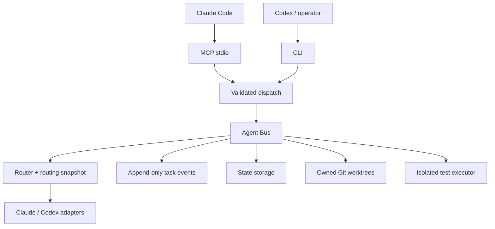

# Architecture

The harness is one TypeScript runtime (`runtime/src`) exposed through two surfaces: an MCP stdio server for Claude Code (`mcp/`) and a CLI for Codex or a human (`cli/`). Both call the same validated dispatch (`runtime/src/surface.ts`), so every operation goes through one core.

## Agent Bus

`runtime/src/agent-bus/index.ts` is the only component that delegates work to a model. The flow for each delegation:

1. Check the task capsule and its scope.
2. Build the prompt: the role's governance, the fixed worker instruction and the capsule JSON.
3. Project the canonical result schema into the provider's wire schema.
4. Run the provider.
5. Parse and validate the `AgentResult`.
6. Check scope, evidence and changed files.
7. Persist the result and its events.

Only the `master-orchestrator` role may drive the bus. Workers never delegate, approve themselves or declare global success.

## Task Capsule

A capsule (`schemas/task-capsule.schema.json`) is the complete, immutable responsibility of one worker. It holds:

- one role and one responsibility;
- goal and inputs;
- `required_context`, `allowed_paths` and `forbidden_paths`;
- constraints and acceptance criteria;
- owned tests;
- a permission ceiling (`read-only` or `restricted-path-write`);
- an optional owned worktree.

A new responsibility or scope means a new child task, never an edited capsule.

## Roles, router and routing snapshot

`roles/registry.json` declares each role's purpose, capabilities, mutation ceiling, required artifacts and the governance documents it receives. Roles carry no model.

`config/routing-profiles.json` maps `role → model class + effort` once, and each profile (`claude`, `codex`) maps `model class → model alias`. `config/models.json` maps aliases to concrete provider identifiers. A root task resolves its profile once and persists the whole `role → provider → model → effort` table in `state/routing/<root>.json`. Children, retries and replays reuse that snapshot. See [routing.md](routing.md).

## Providers and wire projection

`runtime/src/providers/claude.ts` and `codex.ts` wrap the vendor CLIs. The canonical schemas are Draft-07 and richer than what either CLI accepts as a structured-output schema. `providerSchema` works in three steps:

1. **Strip.** It removes the keywords the provider rejects (`WIRE_STRIPPED_KEYWORDS`, keeping only those listed in `PROVIDER_WIRE_KEYWORDS[provider]`).
2. **Re-apply pins.** It adds back deterministic pins derived from the capsule: task and role identity, allowed status set, closed evidence allowlists, citation patterns, owned test commands, proposal and contract identities.
3. **Validate canonically.** After parsing, the result is always validated against the full canonical schema.

The keyword lists come from isolated probes. The wire schema is persisted as `state/provider-agent-result-<hash>.schema.json`.

## Workflow: Task Sense → DONE

The understanding workflow (`runtime/src/workflow/`) runs `Task Sense → Discovery → Flow → Truth → Gap`:

- each stage is a child capsule with a validated `workflow_output`;
- each output is published as an immutable, hash-bound artifact;
- understanding stops at `GAP_DEFINED`.

Explicit engineering actions (`runtime/src/workflow/engineering/`) extend an eligible root:

1. `propose` produces a Proposal;
2. an independent proposal review;
3. for a frontend/backend pair, an API contract that both sides review and then lock;
4. `apply` runs implementation units in owned worktrees;
5. local verification;
6. an independent apply review;
7. `ADVERSARIAL_REVIEW → REVIEW_GATE_APPLY → DONE`.

Units run serially from verified checkpoints. The only exception is the contract pair, which runs with bounded concurrency. The state graph is `runtime/src/state/index.ts`.

## Deterministic verification

Workers never run tests. After a worker returns, the harness itself:

1. snapshots the worktree;
2. scans the unit's JavaScript modules for unsafe imports;
3. runs each owned test command in the isolated executor (Docker, no network, read-only root, only the worktree mounted, Node's permission model);
4. checks that the tests did not mutate the worktree and that the changed files equal the declared ones and stay in scope;
5. records a checkpoint commit.

The published ApplyResult (v2) carries this verification. The worker's own test report is kept apart as `worker_claims`. See [verification.md](verification.md).

## Worktrees and quarantine

Writes happen only in detached worktrees owned by one task and role, created from an explicit base. A failed, interrupted, invalid or out-of-scope write quarantines the worktree. Quarantined worktrees are never reused or deleted automatically. Removal checks ownership, base HEAD, dirtiness and active execution.

## Events and storage

- **Events.** Task state is reconstructed from append-only JSONL events (`state/events/<task>.jsonl`). There is no second mutable state projection.
- **Writes.** Every write uses exclusive creation and fsync; locks are exclusive files.
- **Failure handling.** Truncated logs and stale locks fail closed and need operator inspection.
- **Observations.** Each provider run records a redacted observation (`state/provider-observations/`) with `provider_invoked: true`. Replayed checkpoints record `false`.

## Compatibility: `compatibilityHash` and `adapter_revision`

- **`compatibilityHash`.** A workflow root records the hash of the schemas, the understanding roles, all governance documents, the runtime implementation, the stage semantics and the context budget. A root whose hash no longer matches cannot resume; it stays inspectable through `workflow show`.
- **`adapter_revision`.** The text that enters understanding capsules is versioned. Revisions 1 and 2 are frozen byte for byte; new roots use revision 3. `workflow show` recomputes each child capsule from its recorded revision and rejects a mismatch with `CHILD_CAPSULE_INCOMPATIBLE`.

## Invariants

- A capsule never broadens its role's permission ceiling, and `scope_expanded` is always `false`.
- A read-only capsule reports no changed files.
- Evidence of synthesizing roles (Flow and the proposal and contract reviewers) is closed to sources already present in their inputs.
- Frontier (orchestration) models serve other roles only through a recorded explicit escalation.
- The final gate (`scripts/final-gate.sh`) checks build, types, the full suite, `workflow show` of every root against a baseline, routing snapshot invariants, live provider proofs by hash, and zero leftover test directories.
