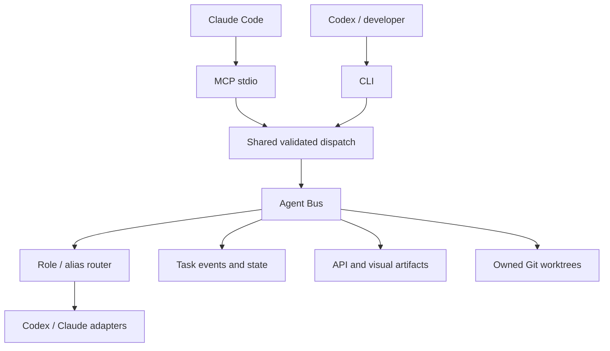

# Operational README (historical snapshot, 2026-09-24)

> Snapshot of the internal operational README before the CQStack public README. Paths and task IDs refer to the original Cartera workspace. Current entry point: [README](../../README.md).

An isolated TypeScript runtime shared by Claude MCP and the Codex/human CLI. Tasks carry explicit capsules; role routing, events, state transitions, immutable artifacts, worktree ownership and output validation live in one core.

## Quick start

From this directory (`.cartera/harness`):

```sh
npm ci --ignore-scripts
npm test
npm run doctor
npm run cli -- roles
npm run cli -- task init examples/discovery-capsule.json
npm run cli -- delegate DEMO-1
npm run cli -- task show DEMO-1
npm run cli -- task events DEMO-1
```

The example is a **dry run**. Reinitializing the same task ID is rejected. Use a new capsule/task ID for another task.

`config/runtime.json` disables model execution by default. `delegate <id> --execute` requires explicitly enabling `model_execution_enabled`, an available authenticated provider and valid prerequisites. Generic mutation additionally requires the separate `config/execution.json` application-write authority (disabled by default) and an owned worktree. General delegation remains disabled; fixed smokes, registered workflow executions and the controlled fixture Apply use scoped, temporary grants over the same delegate.

## One core, two surfaces



- `runtime/src/contracts.ts` defines the internal interfaces.
- `schemas/` contains the canonical Draft-07 protocols; `validation/` compiles them with Ajv.
- `roles/registry.json` supplies each role's purpose, capabilities, mutation ceiling and required artifacts. Roles carry no provider or model.
- `config/routing-profiles.json` is the single source of `role → model class + effort` (`roles`) and lets each routing profile (`claude`, `codex`) resolve only `model class → model alias` (`profiles`). The classes are `orchestration`, `reasoning`, `deep-reasoning` and `mechanical`: `claude` resolves them to Fable 5.1, Opus 5.5, Opus 5.5 and Sonnet 5, and `codex` to Astra, Sol, Sol and Luna. Replacing a model means editing one class entry, never a role. A role without a class, a class a profile does not resolve, a per-role concrete model or a frontier model behind any class other than `orchestration` fails closed. The frontier (orchestration) model serves another role only through an explicit root-level escalation (`routing_escalations` in the request, `--routing-escalation <role>=<reason>` on `task init`), limited to `reasoning`/`deep-reasoning` roles and to the reasons `extreme-review`, `extreme-architecture`, `extreme-debugging` and `extreme-visual-reasoning`; the snapshot records it as `route_reason` (the orchestrator carries `explicit-orchestration`). A failed review, test, schema, provider or contract never escalates. A root task resolves its profile once; the resolved `role → provider → model → effort` snapshot is persisted in `state/routing/<root>.json` and, for workflows, inside the immutable manifest. Children, retries and replays reuse that snapshot; changing the default profile never touches an existing root. There is no automatic fallback, quota detection or provider scoring.
- `config/models.json` is the sole vendor-model identifier mapping. The aliases the profiles use resolve to pinned identifiers (`gpt-6-astra`, `gpt-5.6-sol`, `gpt-5.6-luna`, `claude-fable-5-1[1m]`, `claude-opus-5-5`, `claude-sonnet-5`); each was invoked live under the current policy (`provider_invoked: true`). The legacy `sonnet`/`opus`/`fable` entries are CLI aliases no profile uses. There is no silent provider fallback.
- Node built-ins handle processes, filesystem state and Git. Ajv validates protocols; the MCP SDK supplies the real protocol transport. Dependencies exist only in this package and are pinned by `package-lock.json`.

## CLI and MCP

The workspace `.mcp.json` adds the `cartera` stdio server and preserves the existing Firebase entry. Build before starting it, then reload MCP configuration in the host. This does not modify global Claude/Codex configuration or prove a live Claude session has connected.

Both surfaces call `runtime/src/surface.ts`. Tool names include `task_init`, `task_get`, `task_state`, `task_events`, `roles`, `agent_delegate`, `agent_result`, `worktree_create`, `worktree_list`, `contract_create`, `contract_get`, `contract_lock`, `contract_change_request`, and `visual_lock_get`. `agent_delegate` defaults to dry-run.

Advanced commands use exactly the same input JSON as MCP:

```sh
npm run cli -- call contract_lock path/to/lock-request.json
npm run cli -- call task_state path/to/transition.json
npm run cli -- worktree list
npm run cli -- contract show contract-id version
npm run mcp
```

For isolated experiments, set `CARTERA_HARNESS_STATE` to an absolute directory owned by the experiment. The default is `state/` next to this README. CLI errors use stderr and a nonzero exit; MCP errors use `isError`. MCP stdout carries protocol messages only.

## Capsules, state and review

A capsule is immutable after task creation. Create a child task for a new responsibility or revised scope. `required_context` and scope paths are relative to the worktree, or to the workspace for read-only tasks without a worktree. Paths use literal directory/file prefixes, not glob patterns; forbidden prefixes win. Traversal and symlink boundaries are rejected.

Task Sense/Discovery/Truth/Flow/Gap/review roles default to read-only. Write roles default to `restricted-path-write`; a capsule cannot broaden its role's permission ceiling. Workers receive their capsule and only the governance documents their role declares in `roles/registry.json` (`governance`: every role gets `core.md`, `scope.md` and `agent-behavior.md`; testing, API contract and visual governance go only to the roles that need them), never the orchestrator transcript. The router rejects a role without a declared governance list or naming a missing file.

Every provider response is parsed and schema-validated, then checked against the task ID, role and observed changed paths. `scope_expanded: true` is rejected. A request to expand scope must return `needs_scope_expansion` and structured followups, without performing the extra work.

`completed` is a worker claim, never a task completion gate. DONE requires the explicit state path through `REVIEW_GATE_APPLY` and an approved review bound to a persisted, independently delegated reviewer task. Review workers return their `review_result` inside `AgentResult`; its `reviewer` is the reviewer task ID, and its subject `task_id` is the parent task. The bus verifies the persisted artifact and subject hash. No worker transition directly grants success.

The complete transition graph is in `runtime/src/state/index.ts`. The short route `TASK_CLASSIFIED → IMPLEMENTATION_RUNNING` supports small tasks. Classified tasks requiring API or visual approval must declare the respective `API_CONTRACT_REQUIRED` / `VISUAL_REVIEW_REQUIRED` constraint and supply approved artifact references before execution. Terminal `BLOCKED`, `FAILED` and `DONE` tasks do not resume automatically; create a new task linked to the earlier task instead. Revisions reject stale transitions.

## Worktrees and locks

Create an owned detached worktree with an explicit repository and `base_ref`, then put its returned descriptor into the capsule before `task init`. The manager can inspect a dirty source repository, but never copies its uncommitted changes. `requires_uncommitted_changes: true` fails with `UNCOMMITTED_INPUT_REQUIRED`.

The exposed bus permits only configured workspace repositories. Worktree ownership includes task, role, repository, base ref/commit and optional contract version. Removal checks ownership, registration, unchanged base HEAD, dirtiness (including ignored files), active execution and quarantine; it never force-removes user worktrees. The harness does not provision dependencies, secrets, ports, databases or shared E2E resources in these worktrees.

API contracts model frontend/backend HTTP semantics. Each version is an immutable snapshot. A lock requires distinct backend/frontend reviewer tasks with matching subject hashes. Change requests are separate immutable artifacts and never edit the locked version. New versions require new reviews. Visual schemas and immutable approved-artifact storage exist, but there is no visual approval UI, Storybook integration or exposed worker tool for creating visual approvals.

## Persistence and failure boundaries

Canonical governance, schemas, configuration, examples and intentional reports are source artifacts. `state/`, `dist/`, dependency directories and transient logs are ignored by this package's `.gitignore`. The workspace root currently has no Git repository; these ignore rules become effective when this coordination layer is versioned. No Git repository was initialized and no application repository was used to commit harness files.

Task events are append-only JSONL files with IDs, timestamps, actor, role, type and payload. State is reconstructed from those events, avoiding a second mutable state projection. Writes are synchronized with exclusive local lock files and fsynced. Truncated logs fail closed; this is not a transactional database or tamper-proof audit ledger. Crash recovery and stale-lock handling require operator inspection, never automatic lock deletion.

Codex enforces its read-only/workspace-write sandbox; `workspace-write` implies a shell, which is contained by that sandbox, the before/after snapshot, `assertScope` and the harness's own test verification (the Codex CLI offers no write mode without a shell). Restricted file scope is additionally checked before and after execution in an owned worktree. A rejected or interrupted mutation quarantines that worktree for inspection and forbids reuse/automatic cleanup. Files are preserved; the harness does not roll back user or worker edits automatically. Git metadata and externally reachable services are not comprehensively sandboxed by this layer. Claude runs with strict empty MCP configuration, safe mode and restricted mode; its `--tools` list is fixed per capsule class: `Read,Grep,Glob,Edit,Write` for `restricted-path-write` workers inside their owned worktree (no shell: the harness runs the owned tests), `Read,Grep,Glob` for read-only producers, and none for Flow, the proposal/API-contract reviewers and the orchestrator. Safe mode preserves local OAuth authentication; bare mode does not. Every real provider process records `provider_invoked: true` in its observation; replayed checkpoints record `false`.

The local cockpit and core code are trusted. This foundation is not a security boundary against malicious code running as the same OS user, or an OS-authenticated approval system. Credentials are never captured. Live provider evidence (smokes, routing roots, the controlled Apply) is recorded in `state/` and in the closure artifacts; those claims are limited to the recorded executions. Fable backs only the `claude` orchestration class; the router rejects it behind any other class, a non-orchestrator role reaches it only through a recorded explicit escalation, and the Codex adapter rejects it outright.

See [implementation report](artifacts/phase-1-implementation-report.md), [CLI capabilities](artifacts/local-cli-capabilities.md), [canonical governance](governance/core.md), [workflow compatibility](workflows/current/compatibility.md), and [future workflow graph](workflows/future/graph.md).


## Read-only core understanding workflow

`workflow start` creates an immutable root request. Execution is opt-in and requires both persisted provider smoke results, completion events and successful process observations. `model_execution_enabled` stays false. All workflow children use the existing Agent Bus delegation and result validation; no application worktrees or writes are enabled.

Run from the workspace root (npm runs the CLI with the harness directory as cwd):

```sh
npm --prefix .cartera/harness run cli -- smoke codex MY-CODEX-SMOKE --execute
npm --prefix .cartera/harness run cli -- smoke claude MY-CLAUDE-SMOKE --execute
npm --prefix .cartera/harness run cli -- workflow start examples/phase-2-pagination-workflow.json
npm --prefix .cartera/harness run cli -- workflow resume PHASE2-PAGINATION --execute
npm --prefix .cartera/harness run cli -- workflow show PHASE2-PAGINATION
npm --prefix .cartera/harness run cli -- workflow artifacts PHASE2-PAGINATION
```

The example ID already exists after the live demo; use a fresh task ID in a copied request for another task. Configure successful smoke task IDs in `config/workflow.json` for a new state directory. The smoke command constructs a fixed README-only capsule; it never accepts arbitrary prompts, paths or permission overrides. It resolves its capsule through the routing profile named after the smoked provider (`codex` → `mechanical-worker`, `claude` → `provider-smoke-claude`).

A request supplies the original user text, optional known task type, registered repositories, allowed and forbidden paths, constraints, and focused Discovery nodes. Each node names a **role**; the root's routing profile (`routing_profile` in the request, default from `config/routing-profiles.json`) and `config/models.json` resolve providers, aliases and effort once at `workflow start`. The demonstration decomposes implementation inspection and test inspection into separate roles. Frontend and design-system discovery roles are available when the requested scope needs them.

`Task Sense → Discovery → Flow → Truth → Gap` is backed by child capsules, validated `AgentResult.workflow_output`, immutable artifacts, and events. Task Sense only interprets the request. Discovery triages ambiguities; unresolved blocking policy questions halt before Flow. Flow synthesizes only the validated Task Sense and Discovery artifacts: it receives no read tools, may cite only sources already present in them (never Discovery's own `capsule.allowed_paths / capsule.required_context` scope literal), and when they contain nothing citable its wire schema admits only an honest `blocked` result with `evidence: []`. Truth is a separate provider invocation receiving the original request, claims and evidence, with independent code access and no orchestrator transcript. Gap receives only the request and verified Truth; missing items must reference confirmed Truth claim IDs and their evidence. A completed Truth stage may include rejected, contradicted and unverified findings; its state means the verification ran, not that every prior claim was true.

Each artifact records root/child task, role, actual delegated route, timestamp, source result hash, input references and content hash. Its references and evidence locations are revalidated on inspection. Canonical execution state remains the existing event log; Markdown is a human-readable projection. Understanding transitions reject missing artifacts and stop at `GAP_DEFINED`. Explicit engineering operations extend eligible roots through proposal, controlled apply and independent review.

Resume validates the manifest, role routes, schemas, governance, runtime source/emitted code compatibility and scoped source snapshot before continuing an incomplete workflow. A completed root remains inspectable without executing workers or rewriting its original manifest. Changes to the runtime require a new root for incomplete workflows; automatic migration is not implemented. Resume reuses completed results and artifacts instead of calling earlier workers again. Independent Discovery tasks run with configurable concurrency (1–4) and individual timeouts; every failure remains visible. A per-root lock prevents simultaneous runs. Lock recovery remains manual; never delete a lock without checking its recorded PID and active processes.

Two interrupted persistence boundaries have explicit recovery. An intact child capsule with only its creation event can regain its missing parent authorization after comparison with the expected capsule. A persisted result without its completion event requires the matching pre-persistence validation receipt, bound to the result, capsule and invocation; recovery records completion without calling the provider. Artifacts are validated before publication. Missing receipts, altered results and missing authorization after attempted execution fail closed. These checks do not replace manual handling of stale locks or truncated files.

If initial root creation was interrupted before `workflow.created`, repeat `workflow start` with the identical request. The root capsule binds the entire request hash; only an untouched initialization with the same capsule and, when present, matching manifest can be recovered under the root lock. A successfully initialized root still rejects duplicate starts. Each Discovery child must triage every Task Sense ambiguity once. A blocking ambiguity requires at least one factual closure with evidence and no unresolved or policy answer. A focused child may use `not_applicable` with scoped evidence and a responsibility-boundary explanation; it cannot use that status for a relevant unresolved question. All children reporting `not_applicable` does not close the question. Adapter revision 2 adds this distinction; revision 3 (written by every new root) states each operational constraint once per capsule and makes the Flow honest stop explicit. The text of revisions 1 and 2 is frozen byte for byte (pinned by test), so historical roots stay inspectable without rewriting them.

Reasoning failures are not automatically retried. An explicit `workflow-retry ROOT FAILED-CHILD REASON` creates a fresh child identity for the same responsibility, up to two replacements, preserving all earlier attempts and artifacts. Completed child artifacts cannot be replaced. Revised scope requires a new root request. A narrow exception supports at most two **explicit** retries after recorded pre-inference `invalid_json_schema` rejection and before any result exists:

```sh
npm --prefix .cartera/harness run cli -- workflow resume ROOT --retry-provider-task CHILD --execute
```

The MCP tools `workflow_start`, `workflow_show`, `workflow_resume`, `workflow_artifacts`, and `workflow_retry` call the same service as the CLI. Start/resume default to inspection/no execution. Existing Claude commands and their Markdown dossiers remain unchanged; see the compatibility map for the exact semantic adaptations and deferred solution-tier behavior. No generic `agent_parallel` or second execution engine was added.

An explicit independent architecture review can inspect the finished workflow and source hashes through the same bus, without advancing the product workflow:

```sh
npm --prefix .cartera/harness run cli -- workflow-review ROOT REVIEW-TASK --execute
```

Review results are bound to the workflow/source subject hash and persisted separately. They do not authorize proposal/apply or activate contracts, visual work, Storybook, E2E or UX execution.


## Proposal, controlled Apply and independent gates

`WorkflowService` extends the same bus with `opsx-proposer`, `opsx-propose-reviewer`, `opsx-implementation-worker` and `opsx-apply-reviewer`. Roles resolve centrally through the root's persisted routing snapshot: the proposer is `deep-reasoning`/high and the reviewers and implementation worker are `reasoning`/medium, so they run on Opus 5.5 under `claude` and Sol under `codex`. The Claude implementation worker writes only inside its owned worktree, without a shell. General model execution and application-write authority remain disabled.

```sh
npm --prefix .cartera/harness run cli -- workflow propose ROOT --execute --decision "Explicit PO decision"
npm --prefix .cartera/harness run cli -- workflow proposal ROOT
npm --prefix .cartera/harness run cli -- workflow proposal-review ROOT --execute
npm --prefix .cartera/harness run cli -- workflow apply ROOT --execute
npm --prefix .cartera/harness run cli -- workflow apply-review ROOT --execute
```

Propose consumes verified Gap/Truth, Task Sense, scoped evidence and the explicit cockpit decision. Proposal artifacts include semantic units, dependencies, scope, owned tests and future-gate flags. Independent reviews bind the exact subject hash and never receive proposer reasoning or the orchestrator transcript. Rejected proposals cannot execute. `changes_required` permits an explicit `propose --revise`; each revision is immutable and linked to its predecessor/findings, with at most two revisions. Open product decisions block review until an explicit decision and revised proposal exist. `open_decisions` has exactly one meaning: a product decision that requires a human answer before review; choices delegated to the API Contract Architect or reviewers, warnings, assumptions and request-resolved defaults belong in `risks`, `scope_boundaries` or the unit description. Relations the gates verify byte for byte (result task/role, proposal identity, Gap reference, repositories, review subject hashes, contract identity, owned test commands) are pinned in each provider wire schema, so producers are constrained at inference instead of failing afterwards.

Apply requires the current approved proposal, no future gates, matching capsules and clean owned worktrees at the expected base. The only eligible write repository is the registered harness fixture. Initialize it with `fixture init`; the example `examples/phase-2-owned-write.json` starts its understanding workflow. Each implementation unit uses a separate worktree from the fixture base or its predecessor's verified checkpoint. Units run serially, except the frontend/backend pair of an API contract, which runs after the contract lock with bounded concurrency (`config/workflow.json` `concurrency`). Checkpoints are Git objects; source checkout HEAD and files remain unchanged. No application writes, integration, merge or push occur.

Owned tests are the worker's Definition of Done, but workers do not run them: only the harness does, and its verification is the sole authority. A worker's `tests_executed`/`tests_not_executed` are claims (the schema says so); the v2 ApplyResult publishes the harness verification and keeps the claims apart under `worker_claims`, and a maintenance grant records its own owned-test runs in `maintenance-test-runs/` and a `maintenance.owned_test.executed` event without touching the worker's claim. The runtime executes each owned command in the configured isolated executor (Docker: no network, read-only root, the worktree mounted read-write) with Node's permission model (`--experimental-permission`, filesystem read/write restricted to the worktree, and child processes enabled only for the native test runner). Before execution it scans every JavaScript module in the unit's allowed paths, including imported local modules, and rejects filesystem/process/network imports, encoded or dynamically constructed module names, and write/exec helpers; the fixture has no dependencies. This is a defense-in-depth policy for the controlled fixture, not a general OS sandbox, and application execution remains disabled. It persists exit codes, stdout/stderr, Git diff and scope evidence. It supports local `node --test tests/*.test.mjs` / `.js` commands without dependencies. Failed/interrupted/invalid/out-of-scope writes are quarantined and never automatically reused or deleted. Scope followups, proposal deviations and newly required API/visual gates stop execution. Apply review independently reopens changed files and verification evidence. DONE requires its approved, hash-bound review through the existing `ADVERSARIAL_REVIEW → REVIEW_GATE_APPLY → DONE` edges.

Empty verified Gap requires a no-op proposal with no implementation units/tests. Independent proposal review, explicit no-op Apply verification and independent Apply review use the same state gates; no write worker or worktree is created. API, visual, database or external-resource requirements block Apply. Their specialized workflows remain deferred.

Development checkpoint: `node scripts/bootstrap-phase3-gap.mjs --source <validated-root> --target <fresh-root>` opens a fresh root at `GAP_DEFINED` by replaying the validated understanding artifacts of the source root through the real `WorkflowService` (routing snapshot, capsules, results, artifacts and hashes are all runtime-built; the replay is recorded by actor `gap-checkpoint-replay`, per-child provider observations and a `workflow.understanding.replayed` root event). It is dev tooling outside the CLI/MCP surface and never resumes arbitrary states.

Resume reuses valid artifacts and continues only the last explicitly started incomplete action. It never authorizes the next action implicitly. Failed read-only children without accepted artifacts can be explicitly replaced at most twice through `workflow_engineering_retry`; writes require inspection and a new authorized task. Completed artifacts cannot be replaced. Runtime compatibility is pinned at engineering enrollment; changed code/configuration requires inspection/new execution rather than silent migration.

MCP adds `workflow_propose`, `workflow_proposal`, `workflow_proposal_review`, `workflow_apply`, `workflow_apply_review` and `workflow_engineering_retry` over the same service. Execution defaults to false; no tool accepts arbitrary application-write authority. `workflow_show` and `workflow_artifacts` include engineering state/provenance. Existing legacy commands and OpenSpec artifacts remain available; the structured adapter does not scaffold/move OpenSpec files or synchronize task checkboxes. See [compatibility](workflows/current/compatibility.md) and [completion report](artifacts/phase-2-completion-report.md).
